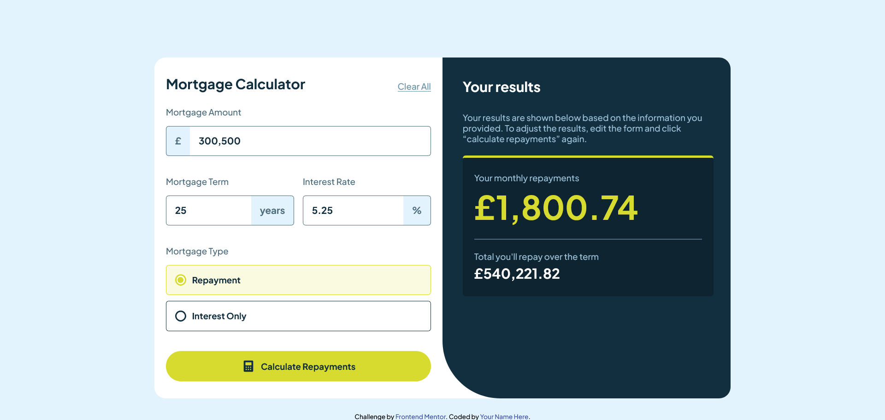

# Frontend Mentor - Mortgage repayment calculator solution

This is a solution to the [Mortgage repayment calculator challenge on Frontend Mentor](https://www.frontendmentor.io/challenges/mortgage-repayment-calculator-Galx1LXK73). Frontend Mentor challenges help you improve your coding skills by building realistic projects. 

## Table of contents

- [Overview](#overview)
  - [The challenge](#the-challenge)
  - [Screenshot](#screenshot)
  - [Links](#links)
- [My process](#my-process)
  - [Built with](#built-with)
  - [What I learned](#what-i-learned)
  - [Continued development](#continued-development)
  - [Useful resources](#useful-resources)
- [Author](#author)

## Overview

### The challenge

Users should be able to:

- Input mortgage information and see monthly repayment and total repayment amounts after submitting the form
- See form validation messages if any field is incomplete
- Complete the form only using their keyboard
- View the optimal layout for the interface depending on their device's screen size
- See hover and focus states for all interactive elements on the page

### Screenshot

### Links

- Solution URL: [Add solution URL here](https://your-solution-url.com)
- Live Site URL: [Add live site URL here](https://your-live-site-url.com)

## My process

### Built with

- Semantic HTML5 markup
- CSS custom properties
- Flexbox
- CSS Grid
- Mobile-first workflow

### What I Learned

This was a very cool project with a lot of stylized elements that were also interactive, like inputs and checkboxes, which had me working overtime. I really underestimated this one, but it did allow me to practice Flexbox and Grid.

One major issue I faced was handling the checkboxes. Thankfully, I got it working with the help of this awesome guide on how to [style radio buttons by Stephanie Eckles](https://moderncss.dev/pure-css-custom-styled-radio-buttons/). Thank you so much!

Ignore the messy JS—though I considered refactoring the project, I’m more focused on learning than making it perfect, so I decided not to (just an excuse for my laziness...). As a result, the interactions might be somewhat buggy. Sorry about that.

Overall, this was a fun project to practice in my free time.

### Continued Development

Lots of refactoring is needed; the CSS styles are pretty messy. Also, vanilla JS leaves much to be desired...

### Useful resources

- [Pure CSS custom styled radio buttons](https://www.example.comhttps://moderncss.dev/pure-css-custom-styled-radio-buttons/) - This really helped me with making the animated checkboxes.

## Author

- Frontend Mentor - [@lucksei](https://www.frontendmentor.io/profile/lucksei)
